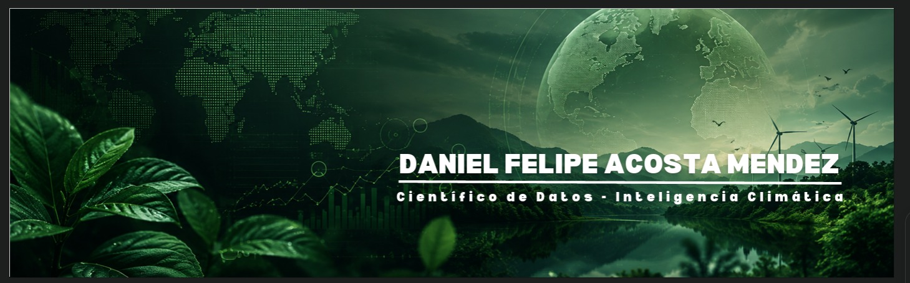
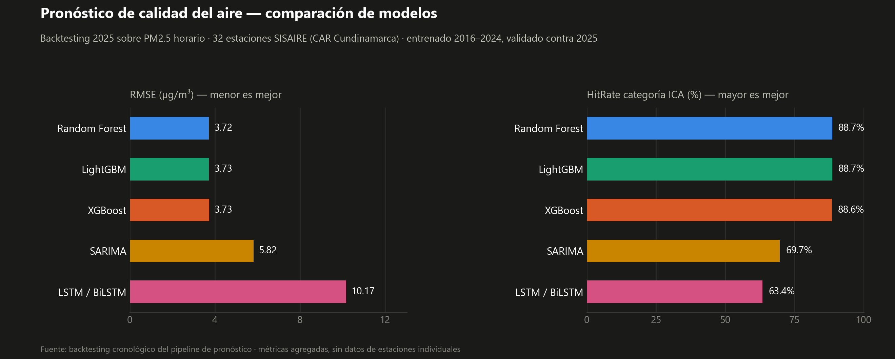
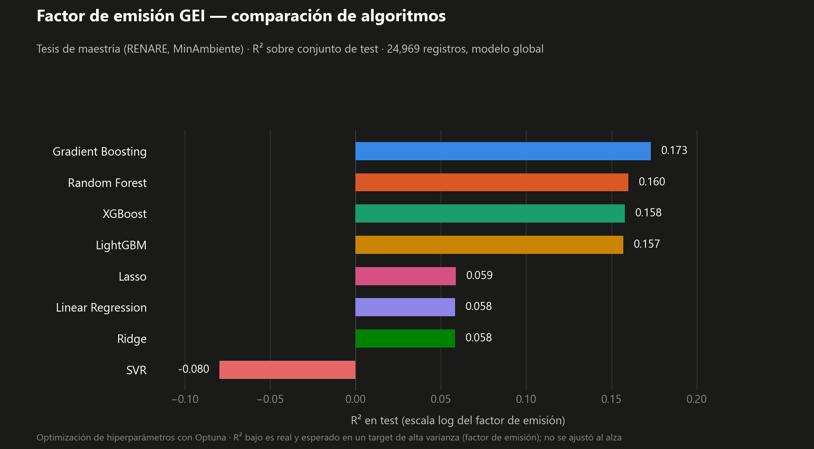
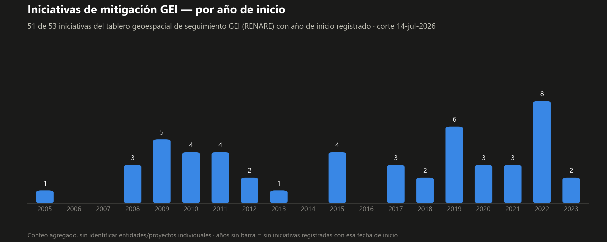

  <a href="#-about-me">About</a> ·
  <a href="#-proyectos-destacados">Proyectos destacados</a> ·
  <a href="#-tech-stack">Tech Stack</a> ·
  <a href="#-skills--dónde-los-aplico">Skills</a> ·
  <a href="#-github-stats">GitHub Stats</a>

## 👋 Sobre mí

- 🔭 Actualmente trabajo como **Analista de Datos** en el **Ministerio de Ambiente y Desarrollo Sostenible (Colombia)**, administrando la plataforma RENARE y construyendo modelos de Machine Learning de inteligencia climática que alimentan el Informe Bienal de Transparencia (BTR) de Colombia y el seguimiento de la NDC.
- 🌱 Actualmente profundizando en **arquitecturas en la nube (AWS y Google Cloud Platform), Data Lakes e IA Generativa (LLMs)** aplicadas a datos ambientales y climáticos.
- 💼 **M.Sc. en Ciencia de Datos** (Pontificia Universidad Javeriana) e **Ingeniero Ambiental**, con experiencia práctica en modelado predictivo, pipelines ETL, MRV, mercados de carbono, monitoreo de calidad del aire y soporte a la toma de decisiones basada en datos. El trabajo reciente incluye consultoría de analítica de datos y automatización documental (9Alliance), integración de datos ambientales y pronóstico con ML para planificación territorial (CAR Cundinamarca), y reportería ETL/BI para seguimiento de impacto de ONG (Solidaridad).
- 🚀 **Proyectos destacados:** un modelo predictivo de factor de emisión de GEI (tesis de maestría, avalada por MinAmbiente), un sistema de pronóstico de calidad del aire PM2.5 para la red SISAIRE en CAR Cundinamarca, y un motor de automatización documental basado en reglas que produce más de 250 informes técnicos sin ninguna llamada a LLM/API.
- 🧩 Me gusta convertir procesos manuales y desordenados basados en hojas de cálculo en **pipelines reproducibles**: ya sea un modelo estadístico/ML, un tablero HTML autocontenible o un job en la nube que antes corría en el computador de alguien.
- 📫 **Contáctame:** [LinkedIn](https://www.linkedin.com/in/danielm-datascientist/) · danielmendez19960@gmail.com

🧭 <b>Professional journey</b> (click to expand)

 

| Period | Role | Organization |
|---|---|---|
| Jun 2024 – Present | Data Analyst — RENARE platform, ML for climate intelligence, environmental ETL | Ministerio de Ambiente y Desarrollo Sostenible |
| 2026 | Data Analytics & Document Automation (Consulting) | 9Alliance |
| Ene 2026 – Jun 2026 | Data Analyst (Consulting) — air quality predictive models, dashboards | CAR Cundinamarca |
| Jun 2025 – Mar 2026 | Data Analyst — ETL & Power BI reporting | Solidaridad |
| Nov 2023 – Feb 2024 | Quality Manager / Project Auditor | NTT DATA |
| Ene 2023 – Sep 2023 | Functional / PMO Analyst | NTT DATA (Banco de Bogotá) |
| Oct 2022 – Mar 2024 | Project Lead | Alcaldía de Suba |
| Nov 2021 – Dic 2022 | Quality Coordinator & IT Lead | Newrona |

**Education:** M.Sc. in Data Science — Pontificia Universidad Javeriana (2026) · Specialization in IT Project Management — Universidad Internacional de La Rioja (2024) · Environmental Engineering — Universidad Antonio Nariño (2021) · Technologist in Quality Management — SENA (2021)

---

## 📌 Proyectos destacados

Una mezcla de un **repo público** (código abierto, con CI/tests/documentación) y **proyectos profesionales** desarrollados para entidades del sector ambiental colombiano. Los detalles de clientes/contratos se omiten deliberadamente; lo que sigue es el problema técnico, la arquitectura y el resultado.

### 📦 [`Estadistica_Ambiental`](https://github.com/DanMendezZz/Estadistica_Ambiental) — librería de ciencia de datos ambiental (PyPI)

Base de conocimiento + librería reutilizable (`pip install estadistica-ambiental`) que cubre el **ciclo estadístico completo** — EDA, descriptiva, inferencial, modelado predictivo y reporte de cumplimiento normativo — para **16 líneas temáticas ambientales** (calidad del aire, oferta hídrica, páramos, humedales, cambio climático, etc.), con la normativa colombiana (Res. 2254/2017, 2115/2007, 631/2015) centralizada en código en vez de hardcodeada por script.

- 639 tests, ~80% cobertura, CI en Linux + Windows, documentación auto-publicada (mkdocs-material) y notebooks navegables **sin instalar nada** vía JupyterLite/Pyodide.
- 19 ADRs documentando decisiones metodológicas (por qué ADF+KPSS obligatorio antes de ARIMA, por qué los outliers ambientales se tratan como señal real y no se descartan, lag hidrológico de ENSO por ecosistema, etc.).
- Validado sobre datos reales: el módulo de calidad del aire alcanzó **RMSE 3.72 µg/m³ y HitRate ICA 88.6%** sobre series horarias de PM2.5, replicado de forma independiente en el proyecto hermano de pronóstico de calidad del aire (ver más abajo).

### 🌫️ Sistema de pronóstico de calidad del aire (consultoría — autoridad ambiental regional)

Pipeline ML end-to-end sobre la red oficial de monitoreo de calidad del aire (PM2.5 horario, 2016–2026, ~32 estaciones activas tras control de calidad): ETL con detección de outliers espacio-temporalmente confirmados, imputación sin fuga de información (interpolación + KNN), ingeniería de variables (lags, rolling, componentes cíclicos, índice climático ENSO/ONI), y comparación de **SARIMA, Random Forest, XGBoost, LightGBM y LSTM/BiLSTM** con optimización bayesiana de hiperparámetros (Optuna) y *backtesting* walk-forward.

- Reportes ejecutivos **autocontenidos** (HTML/R Markdown, un solo archivo, sin dependencias externas) con mapa interactivo del índice de calidad del aire y semáforo de cumplimiento normativo (Res. 2254/2017).
- Además de este pipeline, construí un **framework de generación de dashboards** reutilizado en distintas áreas funcionales de la entidad (áreas protegidas, cambio climático, seguimiento de metas) — mismo patrón ETL → validación → KPIs → tablero, distintas fuentes de datos.

  

*Backtesting cronológico 2025 (entrenado 2016–2024, validado contra 2025) sobre las 32 estaciones activas de la red SISAIRE: los tres modelos de árboles (Random Forest, LightGBM, XGBoost) empatan en desempeño y superan claramente a SARIMA y LSTM tanto en error (RMSE) como en acierto de categoría del Índice de Calidad del Aire (HitRate).*

### 🛰️ Modelo predictivo de factor de emisión de GEI (tesis de maestría, avalada por el Ministerio de Ambiente)

Pipeline de 5 etapas (preprocesamiento → EDA → modelado → interpretabilidad → dashboard) para predecir el factor de emisión de GEI de proyectos registrados en la plataforma RENARE, comparando 7 algoritmos (Linear/Ridge/Lasso, Random Forest, Gradient Boosting, XGBoost, LightGBM, SVR) con **optimización bayesiana vía Optuna** e interpretabilidad con **SHAP/LIME**, servido en un dashboard Streamlit interactivo. En la misma línea de trabajo (seguimiento de iniciativas de mitigación GEI) también construí un dashboard geoespacial **offline** (mapa Leaflet embebido, sin internet) que reconcilia formularios institucionales con documentación técnica georreferenciada (extracción de datos estructurados desde PDF con PyMuPDF, reproyección de coordenadas con GeoPandas/Shapely/Pyproj) para dar trazabilidad a decenas de iniciativas del mercado voluntario de carbono.

  

*R² sobre el conjunto de test (24,969 registros RENARE): los modelos de ensamble de árboles (Gradient Boosting, Random Forest, XGBoost, LightGBM) capturan más señal que la familia lineal (Ridge/Lasso/OLS), y SVR queda por debajo de una línea base. El R² es deliberadamente bajo — es un target de alta varianza — y se muestra sin ajustar al alza.*

  

*Conteo agregado (sin identificar entidades ni proyectos individuales) de las 51 iniciativas de mitigación GEI con año de inicio registrado, de un total de 53 trazadas en el dashboard geoespacial.*

---

## 🛠️ Tech Stack

**Languages**

**Data Science & Machine Learning**

**Cloud & Data Engineering**

-232F3E?style=for-the-badge&logo=amazonaws&logoColor=white)

**Databases**

**Geospatial**

**BI & Visualization**

**Tools & Collaboration**

## 🎯 Skills — dónde los aplico

| Dominio | Herramientas principales | Evidencia real |
|---|---|---|
| Modelado predictivo / series de tiempo | SARIMA, Prophet, XGBoost, LightGBM, Random Forest, LSTM, Optuna | Pronóstico de calidad del aire (32 estaciones); factor de emisión GEI (tesis); ARIMA sobre iniciativas de mitigación |
| Estadística aplicada | ADF/KPSS, Mann-Kendall, Sen's slope, pruebas de hipótesis | Librería `estadistica-ambiental` (16 líneas temáticas, 19 ADRs metodológicos) |
| Interpretabilidad de modelos | SHAP, LIME, feature importance | Tesis de maestría — factor de emisión GEI |
| Automatización documental sin LLM | Motores de reglas deterministas, `python-docx`, control de calidad automatizado | +270 informes técnicos generados en lote, 0 hallazgos en auditoría |
| Dashboards autocontenibles | Leaflet, Chart.js, Plotly, HTML/JSON embebido, R Markdown | Tablero de control multi-empresa; mapa GEI offline; reportes ejecutivos SISAIRE |
| Ingeniería en la nube | GitHub Actions, Microsoft Graph API (MSAL, app-only), reintentos/idempotencia | Migración de jobs locales a la nube, patrón reutilizable documentado |
| Procesamiento geoespacial | GeoPandas, Shapely, Pyproj, reproyección de coordenadas, simplificación de geometrías | Mapa de iniciativas GEI; cartografía SISAIRE (municipios/localidades) |
| BI / reporting | Power BI, Streamlit, ETL a medida | Reportes RENARE, dashboards Streamlit, ETL/BI para seguimiento de impacto |

---

## 📊 GitHub Stats

<!-- Stats y Trophy corren en instancias propias de Vercel (danielmendez19960-2924s-projects),
     no en el despliegue público compartido — inmunes a la pausa por cuota que afectó a ese
     despliegue el 2026-07-24. activity-graph y streak-stats siguen en su servicio público
     porque están arriba y no han mostrado el mismo problema. -->

